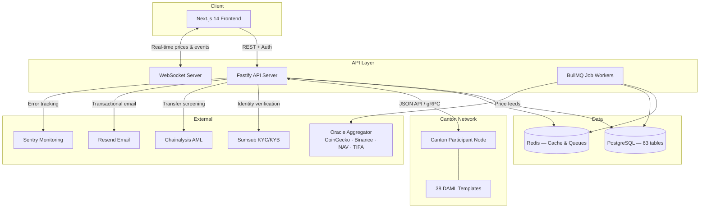

<div align="center">

# Dualis Finance

**Institutional-grade lending infrastructure on Canton Network**

[](https://canton.network)
[](https://www.typescriptlang.org/)
[](https://daml.com)
[](#project-status)

The first hybrid lending protocol where tokenized real-world assets meet DeFi capital markets — built on the network where DTCC custodies $99T in securities.

[Website](https://dualis.finance) · [Architecture](docs/ARCHITECTURE.md) · [API Reference](docs/API_CONTRACT.md) · [Development](docs/DEVELOPMENT.md)

</div>

---

## What is Dualis?

Dualis Finance is a lending protocol designed for tokenized securities on [Canton Network](https://canton.network). When institutions like DTCC tokenize US Treasuries, corporate bonds, and equities on Canton, those tokens need lending markets — supply, borrow, collateralize, and liquidate — with the compliance and privacy guarantees that institutions require.

Traditional securities lending runs on T+2 settlement, manual processes, and opaque prime brokers. DeFi protocols like Aave and Compound solve settlement but lack privacy and regulatory compliance. Dualis bridges both: DeFi-native capital efficiency with Canton's sub-transaction privacy, institutional KYC/KYB, and DAML smart contract safety.

**Core capabilities:**
- **Hybrid credit scoring** — On-chain history + off-chain ZK credentials + ecosystem reputation (0–1000 scale)
- **4-tier collateral framework** — Sovereign bonds to trade receivables, each with risk-appropriate LTV ratios
- **Securities lending marketplace** — P2P offers, fractional lending, automated netting
- **Dual-track access** — Institutional (KYB-verified, API access, dedicated pools) and retail (wallet-connect, self-custody)
- **Privacy by design** — Canton sub-transaction privacy with 3 user-selectable disclosure levels

Built by [Cayvox Labs](https://cayvox.com), which operates three products across the Canton stack: [PartyLayer](https://github.com/cayvox/partylayer) (middleware SDK), Dualis Finance (DeFi lending), and TIFA Finance (asset tokenization).

## Project Status

| Metric | Value |
|--------|-------|
| TypeScript | 116,000+ lines |
| DAML | 11,300+ lines |
| API Endpoints | 272 |
| Database Tables | 63 |
| Frontend Pages | 43 |
| React Components | 119 |
| Zustand Stores | 20 |
| DAML Templates | 38 (across 25 modules) |
| DAML Test Suites | 11 |
| Oracle Feeds | 11 assets, 4 sources |
| Canton Commands | 32 write operations |
| Network | **Devnet Live** |

## Features

<details>
<summary><strong>Lending Protocol</strong> — Supply, borrow, flash loans</summary>

- Supply liquidity to multi-asset pools and earn yield
- Borrow against multi-tier collateral with dynamic interest rates (jump-rate model)
- Health factor monitoring with configurable alert thresholds
- Flash loans (0.05% fee, single-transaction atomic execution)
- Institutional dedicated pools with custom terms and risk parameters
- Index-based interest accrual (O(1) per block, gas-efficient)

</details>

<details>
<summary><strong>4-Tier Collateral Framework</strong> — From sovereign bonds to trade receivables</summary>

| Tier | Asset Types | Max LTV | Liquidation Penalty |
|------|-------------|---------|---------------------|
| **1** | Tokenized Treasuries, Sovereign Bonds | 90% | 5% |
| **2** | Corporate Bonds, Canton Coin, Blue-chip Equities | 75% | 7% |
| **3** | Trade Receivables, Private Credit | 60% | 10% |
| **4** | Newly listed assets (governance-approved) | 45% | 10% |

Asset-agnostic design: any Canton-native token can become eligible collateral through governance.

</details>

<details>
<summary><strong>Hybrid Credit Scoring</strong> — 3-layer composite, 5 tiers</summary>

Three signal layers combined into a single 0–1000 score:

1. **On-chain history** — Repayment track record, liquidation history, protocol usage
2. **Off-chain credentials** — ZK-verified credit data, institutional attestations
3. **Ecosystem reputation** — Cross-protocol behavior on Canton Network

| Tier | Score Range | Rate Discount | Max LTV Bonus |
|------|------------|---------------|---------------|
| Diamond | 900–1000 | 30% | +15% |
| Platinum | 750–899 | 20% | +10% |
| Gold | 600–749 | 10% | +5% |
| Silver | 400–599 | 5% | +2% |
| Bronze | 0–399 | 0% | 0% |

High-credit borrowers unlock under-collateralized lending.

</details>

<details>
<summary><strong>Securities Lending</strong> — P2P marketplace for tokenized assets</summary>

- P2P offer/accept marketplace for any tokenized security
- Fractional lending — lend portions of positions
- Asset-agnostic collateral acceptance across tiers
- Automated netting agreements for bilateral positions
- Corporate action handling (dividends, splits, rights)
- Dynamic fee calculation based on utilization and asset demand

</details>

<details>
<summary><strong>Governance</strong> — On-chain proposals via DUAL token</summary>

- Proposal lifecycle: Draft → Active → Succeeded/Defeated → Queued → Executed
- Token-weighted voting (For / Against / Abstain)
- Vote delegation system
- Timelock execution (48h standard, 6h emergency)
- Quorum requirements (10% of circulating supply)
- Admin veto for security-critical proposals

</details>

<details>
<summary><strong>Productive Finance</strong> — DeFi capital for real-world projects</summary>

- Fund real productive projects (infrastructure, renewable energy, supply chain)
- IoT-verified project monitoring and attestation
- ESG rating integration with rate bonuses
- Cashflow-based repayment tracking
- Risk-weighted returns based on project category

</details>

<details>
<summary><strong>Privacy & Compliance</strong> — Institutional-grade from day one</summary>

- **Canton sub-transaction privacy** — Data visible only to involved parties
- **3 user-selectable privacy levels** with disclosure rule management
- **Sumsub** KYC/KYB verification (frontend widget + backend webhooks)
- **Chainalysis** transfer screening and exposure analysis
- **GDPR** data deletion requests and audit logging
- Role-based access control with admin audit trails

</details>

<details>
<summary><strong>Oracle & Price Feeds</strong> — 11 assets, 4 sources</summary>

| Source | Assets | Type |
|--------|--------|------|
| CoinGecko | BTC, wBTC, ETH, USDC, USDT, CC | Crypto |
| Binance | BTC, wBTC, ETH, USDC, USDT | Crypto |
| Manual NAV | T-BILL-2026, SPY-2026, US-T10Y, T-BILL | RWA |
| TIFA | DUAL | Protocol token |

Multi-source aggregation with staleness detection, circuit breakers, and fallback mechanisms.

</details>

## Architecture

```
dualis-finance/
├── packages/
│   ├── frontend/        Next.js 14 — 43 pages, 119 components, 20 stores
│   ├── api/             Fastify 5.7 — 272 endpoints, 63 tables, WebSocket
│   ├── shared/          94 shared types, 30+ utility functions, config
│   ├── canton/          DAML smart contracts — 38 templates, 25 modules
│   └── config/          Shared tsconfig, ESLint
├── deploy/
│   ├── canton/          Canton node configuration
│   ├── monitoring/      Prometheus, Grafana, Alertmanager
│   ├── nginx/           Reverse proxy, SSL termination
│   ├── railway/         Railway deployment configs
│   └── scripts/         DAR upload, deployment automation
├── docs/                Architecture, API contract, development guides
└── docker-compose.yml   Full-stack orchestration (+ dev, prod, devnet variants)
```



### Tech Stack

| Layer | Technology | Version |
|-------|-----------|---------|
| **Frontend** | Next.js (App Router) | 14.2 |
| **UI** | Tailwind CSS, Radix UI, Framer Motion | — |
| **State** | Zustand | 5.0 |
| **Charts** | Recharts | 3.7 |
| **API Server** | Fastify | 5.7 |
| **Database** | PostgreSQL + Drizzle ORM | 16 / 0.45 |
| **Cache & Queues** | Redis + BullMQ | 7.2 / 5.70 |
| **Validation** | Zod | 4.3 |
| **Smart Contracts** | DAML on Canton Network | SDK 3.4.11, LF 2.1 |
| **Auth** | JWT + bcrypt + session cookies | — |
| **KYC/AML** | Sumsub + Chainalysis | — |
| **Resilience** | opossum (circuit breaker) | — |
| **Email** | Resend | — |
| **Monitoring** | Sentry, Prometheus, Grafana | — |
| **Monorepo** | pnpm + Turborepo | 9.15 |
| **Containers** | Docker Compose | — |

### DAML Smart Contract Modules

<details>
<summary><strong>25 modules, 38 templates</strong> — Click to expand</summary>

| Module | Templates | Purpose |
|--------|-----------|---------|
| `Dualis.Types` | — | Core domain types (CreditTier, InterestRateModel, etc.) |
| `Dualis.Core.Config` | ProtocolConfig | On-chain protocol parameters |
| `Dualis.Lending.Pool` | LendingPool, SupplyPosition | Pool management and supply positions |
| `Dualis.Lending.Borrow` | BorrowPosition | Individual borrow tracking |
| `Dualis.Lending.Collateral` | CollateralVault | Collateral custody and LTV enforcement |
| `Dualis.Lending.Math` | — | Interest rate calculations (Taylor series exp/ln) |
| `Dualis.Liquidation.Engine` | LiquidationTrigger, LiquidationResult, FlashLiquidation, BatchLiquidation | Liquidation execution |
| `Dualis.Credit.Attestation` | CreditAttestationBundle | Credit credential attestations |
| `Dualis.Credit.CompositeScore` | CompositeCredit | Composite credit scoring |
| `Dualis.Oracle.PriceFeed` | PriceFeed, PriceOracle | On-chain price records |
| `Dualis.Token.DUAL` | DUALToken, StakingPosition, TokenVesting | Governance token, staking, vesting |
| `Dualis.Governance.Config` | GovernanceConfig | Governance parameters |
| `Dualis.Governance.Proposal` | Proposal | On-chain proposals |
| `Dualis.Governance.Vote` | VoteRecord | Vote records |
| `Dualis.Governance.Delegation` | VoteDelegation | Vote delegation |
| `Dualis.Governance.Timelock` | TimelockExecution | Timelock execution queue |
| `Dualis.Governance.Token` | DualTokenBalance, DualMintFactory, BalanceSnapshot | Token balance tracking |
| `Dualis.SecLending.Advanced` | FractionalOffer, CorporateActionHandler, NettingAgreement | Securities lending marketplace |
| `Dualis.Institutional.Core` | VerifiedInstitution, InstitutionalPool, BulkOperation | Institutional features |
| `Dualis.Productive.Core` | ProductiveProject, ProductiveLendingPool, ProductiveBorrow | Productive finance |
| `Dualis.Privacy.Config` | PrivacyConfig | Privacy level management |
| `Dualis.Trigger.InterestAccrual` | InterestAccrualTrigger | Automated interest accrual |
| `Dualis.Trigger.LiquidationScanner` | LiquidationScanner | Automated liquidation scanning |
| `Dualis.Trigger.OracleAggregator` | OracleAggregator | Price feed aggregation |
| `Dualis.Trigger.StalenessChecker` | StalenessChecker | Price staleness detection |

</details>

## Getting Started

### Prerequisites

- **Node.js** 20.x (`>=20.0.0 <22.0.0`)
- **pnpm** 9.x (`>=9.0.0`)
- **PostgreSQL** 16
- **Redis** 7.2
- **Docker** & **Docker Compose** (recommended)
- **DAML SDK** 3.4.11 (for smart contract development)

### Quick Start

```bash
# Clone
git clone https://github.com/cayvox/dualis-finance.git
cd dualis-finance

# Install dependencies
pnpm install

# Configure environment
cp .env.example .env
# Edit .env with your database, Redis, and Canton connection details

# Start all services (PostgreSQL, Redis, API, Frontend)
pnpm dev
```

### Docker (Recommended)

```bash
# Full stack with PostgreSQL + Redis + API + Frontend
docker compose up -d

# Development mode with hot-reload
docker compose -f docker-compose.yml -f docker-compose.dev.yml up -d

# View logs
docker compose logs -f api

# Stop everything
docker compose down
```

Four compose configurations are available: `docker-compose.yml` (base), `docker-compose.dev.yml`, `docker-compose.prod.yml`, and `docker-compose.devnet.yml`.

<details>
<summary><strong>Environment Variables</strong></summary>

Copy `.env.example` and configure:

**Application**
| Variable | Description |
|----------|-------------|
| `NODE_ENV` | `development` / `production` |
| `PORT` | API server port |
| `HOST` | API server host |
| `LOG_LEVEL` | Pino log level |

**Frontend**
| Variable | Description |
|----------|-------------|
| `NEXT_PUBLIC_API_URL` | API base URL for client |
| `NEXT_PUBLIC_WS_URL` | WebSocket URL for real-time data |
| `NEXT_PUBLIC_APP_URL` | Frontend application URL |

**Database & Cache**
| Variable | Description |
|----------|-------------|
| `DATABASE_URL` | PostgreSQL connection string |
| `DATABASE_POOL_MIN` | Minimum connection pool size |
| `DATABASE_POOL_MAX` | Maximum connection pool size |
| `REDIS_URL` | Redis connection string |

**Canton Network**
| Variable | Description |
|----------|-------------|
| `CANTON_JSON_API_URL` | Canton JSON API endpoint |
| `CANTON_GRPC_URL` | Canton gRPC endpoint |
| `CANTON_OPERATOR_PARTY` | Protocol operator party ID |
| `CANTON_ORACLE_PARTY` | Oracle operator party ID |
| `CANTON_CREDIT_ASSESSOR_PARTY` | Credit assessor party ID |
| `CANTON_TREASURY_PARTY` | Treasury party ID |

**Auth**
| Variable | Description |
|----------|-------------|
| `JWT_SECRET` | JWT signing secret |
| `JWT_EXPIRY` | Token expiration duration |

**Compliance**
| Variable | Description |
|----------|-------------|
| `SUMSUB_APP_TOKEN` | Sumsub API token |
| `SUMSUB_SECRET_KEY` | Sumsub webhook secret |

**Feature Flags**
| Variable | Description |
|----------|-------------|
| `ENABLE_SEC_LENDING` | Enable securities lending module |
| `ENABLE_FLASH_LOANS` | Enable flash loan functionality |
| `ENABLE_GOVERNANCE` | Enable governance module |

**Monitoring**
| Variable | Description |
|----------|-------------|
| `SENTRY_DSN` | Sentry error tracking DSN |
| `NEXT_PUBLIC_SENTRY_DSN` | Sentry DSN for frontend |

See `.env.example` for the complete list of 48 variables.

</details>

## Development

### Scripts

| Command | Description |
|---------|-------------|
| `pnpm dev` | Start all services in development mode (Turborepo) |
| `pnpm build` | Build all packages |
| `pnpm test` | Run all test suites |
| `pnpm lint` | Lint all packages |
| `pnpm typecheck` | TypeScript type checking across all packages |
| `pnpm clean` | Remove build artifacts and node_modules |
| `pnpm start` | Start all services via `scripts/start-all.sh` |
| `pnpm start:quick` | Start without monitoring and DAML |
| `pnpm start:fresh` | Start with a fresh database |
| `pnpm docker:up` | Start Docker containers |
| `pnpm docker:down` | Stop Docker containers |
| `pnpm docker:build` | Build Docker images |
| `pnpm docker:logs` | Stream Docker logs |

### Package-Specific Commands

```bash
# Frontend only
pnpm --filter @dualis/frontend dev

# API only
pnpm --filter @dualis/api dev

# Shared library (must build first — dependency for API and frontend)
pnpm --filter @dualis/shared build

# Run shared math tests
pnpm --filter @dualis/shared test

# DAML contracts
cd packages/canton/daml
~/.daml/bin/daml build       # Compile contracts → .daml/dist/dualis-finance-2.0.0.dar
~/.daml/bin/daml test        # Run 11 DAML test suites
```

### Database

Dualis uses **Drizzle ORM** with PostgreSQL. Schema is defined in `packages/api/src/db/schema.ts` (63 tables).

```bash
# Generate migrations from schema changes
pnpm --filter @dualis/api drizzle-kit generate

# Push schema directly (development)
pnpm --filter @dualis/api drizzle-kit push

# Open Drizzle Studio (visual database browser)
pnpm --filter @dualis/api drizzle-kit studio
```

## API Reference

Dualis exposes 272 REST endpoints with WebSocket support for real-time data.

**Base URL:** `http://localhost:4000/v1` (development)

**Authentication:** JWT Bearer token on protected endpoints.

| Group | Prefix | Description |
|-------|--------|-------------|
| Health | `/health` | Liveness, readiness probes |
| Auth | `/auth` | Registration, login, sessions |
| Pools | `/pools` | Market data, rates, utilization, history |
| Supply | `/supply` | Deposit and withdraw liquidity |
| Borrow | `/borrow` | Borrow, repay, add collateral |
| Credit | `/credit` | Composite scores, attestations, simulation |
| Oracle | `/oracle` | Price feeds, historical data |
| Flash Loans | `/flash-loans` | Atomic flash loan execution |
| Securities Lending | `/sec-lending` | Offers, deals, fractional, netting |
| Governance | `/governance` | Proposals, voting, delegation |
| Staking | `/staking` | Stake/unstake DUAL, claim rewards |
| Productive | `/productive` | Projects, pools, IoT readings |
| Institutional | `/institutional` | KYB, API keys, bulk operations |
| Privacy | `/privacy` | Privacy levels, disclosures |
| Compliance | `/compliance` | KYC status, AML screening, GDPR |
| Analytics | `/analytics` | Protocol metrics, portfolio, tax reports |
| Notifications | `/notifications` | Preferences, webhooks, alerts |
| Admin | `/admin` | Protocol management, user admin, audit |
| WebSocket | `/v1/ws` | Real-time prices, positions, governance events |

Full specification with request/response schemas: **[docs/API_CONTRACT.md](docs/API_CONTRACT.md)**

## Testing

All packages use **Vitest** as the test runner.

```bash
# Run all tests
pnpm test

# Shared package (math engine, utils, config)
pnpm --filter @dualis/shared test

# API integration tests
pnpm --filter @dualis/api test

# Frontend component tests
pnpm --filter @dualis/frontend test

# DAML contract tests (11 test suites)
cd packages/canton/daml && ~/.daml/bin/daml test
```

Test suites cover:
- **Shared** — Interest rate math, APR/APY conversions, health factor calculations, collateral params, credit tier logic
- **API** — Route handlers, services, middleware, Canton command builders, oracle aggregation, compliance flows
- **Frontend** — Component rendering, store behavior, hook logic
- **DAML** — Pool operations, borrowing, liquidation, credit scoring, governance, oracle, token mechanics, integration scenarios

## Deployment

### Canton Devnet (Current)

Dualis is deployed on Canton Devnet with 38 DAML templates active on a Canton Validator node (v0.5.12).

```bash
# Build and upload DAR to Canton participant
./deploy/scripts/upload-dar.sh

# Verify deployment only
./deploy/scripts/upload-dar.sh --verify-only

# Skip DAML build, upload existing DAR
./deploy/scripts/upload-dar.sh --skip-build
```

### Environments

| Environment | API | Frontend | Status |
|-------------|-----|----------|--------|
| Development | `localhost:4000` | `localhost:3000` | Local |
| Devnet | `api.dualis.finance` | `dualis.finance` | **Live** |
| Production | — | — | Planned |

### Monitoring

Production deployments include Prometheus metrics collection, Grafana dashboards, and Alertmanager for operational alerts. Configuration in `deploy/monitoring/`.

- **Grafana**: `http://localhost:3002`
- **Prometheus**: `http://localhost:9090`

## Canton Network

Dualis is purpose-built for Canton because it's where institutional capital lives:

- **DTCC** — $99T in custody, tokenizing US Treasuries on Canton
- **Goldman Sachs, Euroclear, LSEG** — Active Canton participants
- **Sub-transaction privacy** — Counterparties see only their own transaction data
- **DAML contracts** — Type-safe, formally verifiable, designed for financial workflows
- **Regulatory alignment** — Built for regulated markets; DTCC received SEC No-Action Letter

## Security

### Reporting Vulnerabilities

**security@cayvox.com** — Do not open public issues for security vulnerabilities.

### Security Measures

| Layer | Measures |
|-------|----------|
| **Authentication** | JWT with refresh rotation, bcrypt password hashing, session management |
| **API Security** | Rate limiting, Helmet.js headers, CORS, CSRF protection, Zod input validation |
| **Access Control** | Role-based (RBAC), admin audit logging |
| **Compliance** | Sumsub KYC/KYB verification, Chainalysis transfer screening |
| **Privacy** | Canton sub-transaction privacy, user-selectable disclosure levels, GDPR compliance |
| **Smart Contracts** | DAML signatory/observer authorization model, type-safe contract execution |
| **Infrastructure** | Circuit breaker patterns (opossum), graceful degradation, Sentry error tracking |

## Roadmap

| Phase | Timeline | Status |
|-------|----------|--------|
| Core protocol design, DAML contracts, devnet validator | Q4 2024 – Q1 2025 | Done |
| Full-stack implementation, 25 DAML modules, devnet deployment | Q1 – Q4 2025 | Done |
| Security audit, codebase hardening, mainnet preparation | Q1 – Q2 2026 | In Progress |
| Canton mainnet deployment, institutional onboarding | Q2 – Q3 2026 | Planned |
| Securities lending marketplace, credit oracle API, partnerships | Q3 – Q4 2026 | Planned |

## Contributing

1. Fork the repository
2. Create a feature branch: `git checkout -b feature/your-feature`
3. Follow existing code style (TypeScript strict mode, Prettier, ESLint)
4. Run `pnpm test && pnpm lint && pnpm typecheck` before submitting
5. Open a pull request

## Documentation

| Document | Description |
|----------|-------------|
| [ARCHITECTURE.md](docs/ARCHITECTURE.md) | System architecture and design decisions |
| [API_CONTRACT.md](docs/API_CONTRACT.md) | Full API specification (1,800+ lines) |
| [DEVELOPMENT.md](docs/DEVELOPMENT.md) | Development setup and workflow guide |
| [DAML_REFERENCE.md](docs/DAML_REFERENCE.md) | DAML contract reference |
| [BUILD_ORDER.md](docs/BUILD_ORDER.md) | Package build dependency order |

## License

All rights reserved.

## Links

- [Website](https://dualis.finance)
- [Canton Network](https://canton.network)
- [Cayvox Labs](https://cayvox.com)

---

<div align="center">

**Built by [Cayvox Labs](https://cayvox.com)**

Institutional DeFi infrastructure for the tokenized economy

</div>
